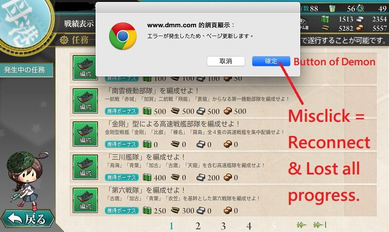
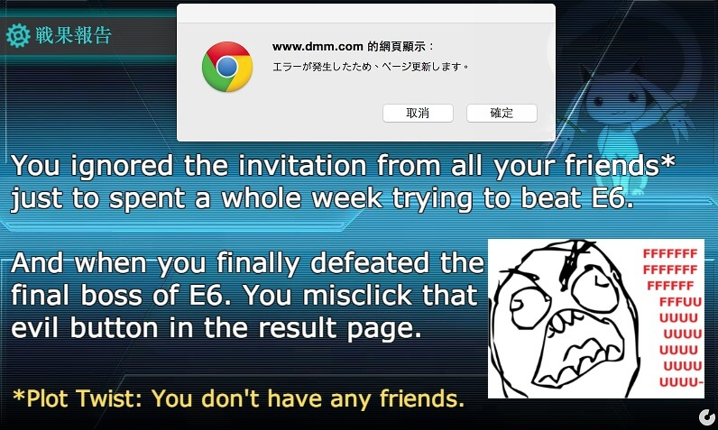
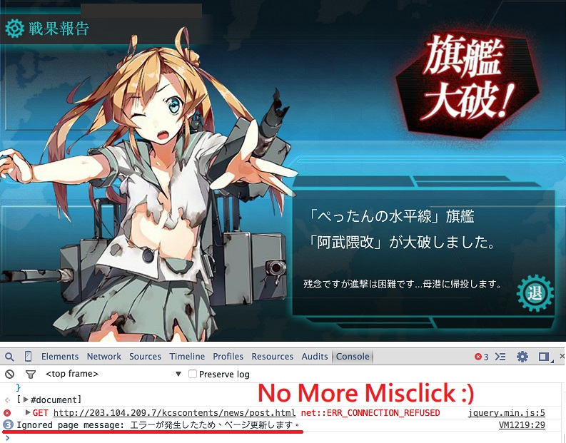

## Kancolle Error Message Redirect

Redirect the "エラーが発生したため、ページ更新します" message from `window.confirm()` to `console.log()`.

## Description

When playing 艦隊これくしょん, an error message "エラーが発生したため、ページ更新します" would sometimes shows up. The message means "An error has occured, please refresh."

**But it is a trap !**.

If you click `cancel`, the game would continue without any problem. However, if you click `ok`, it would refresh the whole page including the game itself, and you will lost all progresses which were not sync between client and server yet.

This simple javascript redirect the "エラーが発生したため、ページ更新します" message from `window.confirm()` to `console.log()`. So there will be no more misclicks.

## License

[Do What The Fuck You Want To Public License (WTFPL)](http://www.wtfpl.net/about/)
